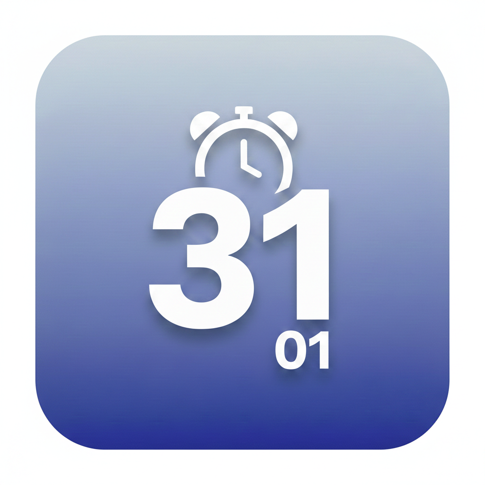
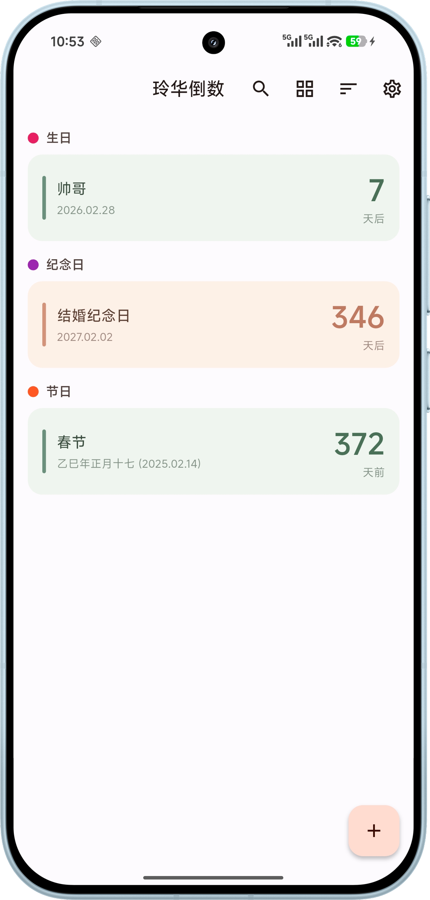
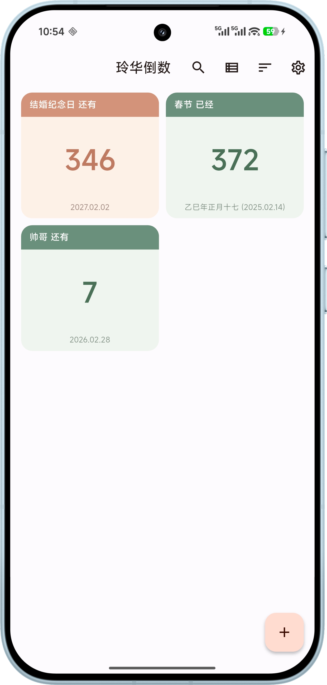
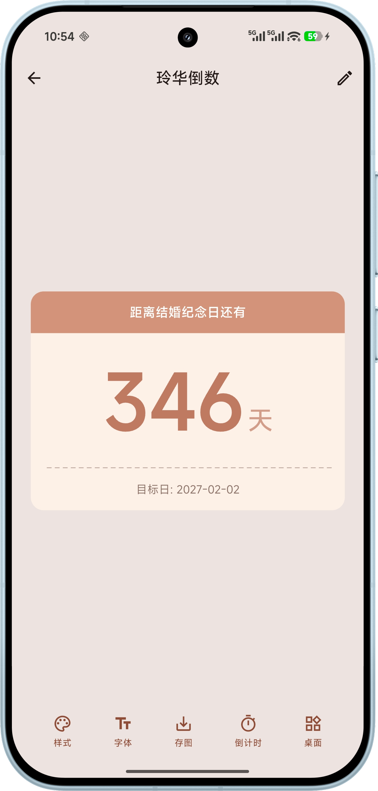

<div align="center">
    
</div>

<div align="center">
    <h1>玲华倒数</h1>


[](LICENSE)

<p>使用 Flutter 开发的本地倒数日应用，支持公历和农历日期，帮助你管理和追踪重要日期</p>




<br/>
</div>

## 功能

- [x] 日期相关
  - [x] 公历和农历日期创建倒数日
  - [x] 农历自动转换公历计算
  - [x] 每年重复自动计算下一次倒计时
  - [x] 全屏横屏沉浸式倒计时，秒级实时刷新，归零庆祝动效

- [x] 卡片风格
  - [x] 7 种预设卡片风格（简约/渐变/玻璃/阴影/深邃/手绘/节日）
  - [x] 支持自定义背景图片、颜色、字体
  - [x] 列表视图和网格视图自由切换

- [x] 分类管理
  - [x] 预设 5 种分类（生日/纪念日/节日/工作/考试）
  - [x] 支持自定义分类和颜色
  - [x] 按分类筛选和分组显示

- [x] 提醒通知
  - [x] 本地通知提醒
  - [x] 支持提前天数设置（当天/1天/3天/7天/14天/30天）
  - [x] 自定义提醒时间

- [x] 数据管理
  - [x] JSON 格式导入导出
  - [x] 导入时支持重复检测
  - [x] 跨设备按名称匹配关联分类和样式

- [x] 其他
  - [x] 应用内检查更新，Android 支持 APK 下载安装
  - [x] Material Design 3 规范，支持壁纸取色（Android 12+）
  - [x] 搜索倒数日
  - [x] 多种排序方式（剩余天数/创建时间/名称）

## 下载

可以通过右侧 Releases 进行下载，或拉取代码到本地编译。

### 从源码构建

```bash
git clone https://github.com/linghualive/linghuadays.git
cd linghuadays
flutter pub get
flutter run
```

```bash
# Android APK
flutter build apk --release
```

## 赞赏

如果觉得这个项目对你有帮助，欢迎请我喝杯咖啡 :)


## 开源协议

本项目基于 [GPL-3.0](LICENSE) 协议开源。
